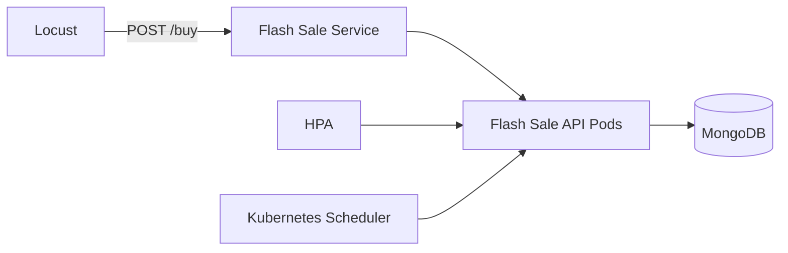

# Flash Sale Simulator

Dự án mô phỏng một hệ thống flash sale chạy trên Kubernetes/Minikube, gồm:

- `FastAPI` API nhận đơn hàng tại `/buy`
- `MongoDB` lưu đơn hàng giả lập
- `Locust` tạo burst 50k request để mô phỏng giờ cao điểm
- `Horizontal Pod Autoscaler (HPA)` tự scale app khi CPU tăng cao
- Multi-node Minikube để demo self-healing khi sập một worker node

## Mục đích của repository

Repository này được xây dựng để người chấm có thể kiểm tra toàn bộ demo theo đúng yêu cầu cuối kỳ, bao gồm:

- triển khai ứng dụng lên Kubernetes
- quan sát HPA tự scale khi có burst request lớn
- mô phỏng sự cố bằng cách tắt một worker node
- chứng minh hệ thống vẫn duy trì dịch vụ và tự điều phối lại pod

## Mục tiêu demo cuối kỳ

Dự án này được chuẩn bị để quay video chứng minh 2 ý chính:

1. Hệ thống **tự scale up** khi nhận burst traffic lớn, mô phỏng flash sale.
2. Hệ thống **tự khắc phục** khi một worker node bị tắt, các pod còn sống vẫn tiếp tục phục vụ.

## Cấu trúc thư mục

- `main.py`: source code FastAPI.
- `Dockerfile`: build image cho API.
- `k8s-setup.yaml`: manifest Kubernetes cho Deployment, Service và HPA.
- `locustfile.py`: kịch bản load test bằng Locust.
- `requirements.txt`: thư viện Python cần cài.

## Sao chép repository

```powershell
git clone https://github.com/ngvanhau1604/CSDLPT.git
cd CSDLPT
```

## Yêu cầu môi trường

- Windows PowerShell
- Docker Desktop
- Minikube
- kubectl
- Python 3.11+ hoặc Python đang dùng trên máy
- Locust đã cài trong Python environment hiện tại

## Ghi chú quan trọng trước khi chạy

- Cụm Minikube cần tối thiểu 3 node: 1 control plane và 2 worker.
- HPA chỉ hoạt động khi `metrics-server` đã ở trạng thái `Ready`.
- Image `flash-sale-app:latest` phải được build và nạp vào Minikube trước khi deploy.

## Kiến trúc hệ thống



## Chức năng chính

- `POST /buy`: tạo đơn hàng giả lập, ghi vào MongoDB và tạo thêm tải CPU để HPA có tín hiệu rõ hơn.
- `GET /health`: endpoint kiểm tra sống còn cho Kubernetes.
- HPA của `flash-sale-app`: scale từ 3 đến 8 replicas theo CPU.

## Hướng dẫn triển khai và kiểm tra

### 0. Chuẩn bị mã nguồn và môi trường

Nếu bạn vừa clone repository, hãy bảo đảm đang đứng tại thư mục dự án trước khi chạy các lệnh bên dưới.

### 1. Cài dependencies Python

```powershell
python -m pip install -r requirements.txt
```

### 2. Tạo cluster Minikube 3 node

Nếu bạn đang muốn demo theo đúng bài, hãy tạo cluster 3 node:

```powershell
minikube delete -p minikube
minikube start -p minikube --driver=docker --nodes=3 --cpus=3 --memory=6144 --disk-size=30g
kubectl get nodes -o wide
```

Kết quả mong muốn:

- `minikube` = `Ready`
- `minikube-m02` = `Ready`
- `minikube-m03` = `Ready`

### 3. Bật metrics-server cho HPA

```powershell
minikube addons enable metrics-server -p minikube
```

Chờ vài chục giây cho `metrics-server` chuyển sang `Ready`.

Kiểm tra lại:

```powershell
kubectl get pod -n kube-system
kubectl top nodes
```

### 4. Build image Docker

```powershell
docker build -t flash-sale-app:latest -f Dockerfile .
```

### 5. Nạp image vào Minikube

```powershell
minikube image load flash-sale-app:latest
```

Nếu gặp `ImagePullBackOff` ở một node worker, hãy xóa pod lỗi để Kubernetes tạo lại pod mới:

```powershell
kubectl delete pod <pod-name>
```

Sau đó kiểm tra image đã có trong cluster:

```powershell
minikube image ls | Select-String flash-sale-app
```

### 6. Deploy lên Kubernetes

```powershell
kubectl apply -f k8s-setup.yaml
kubectl get pods -o wide
kubectl get hpa
```

Kết quả mong đợi ban đầu:

- `flash-sale-app` có 3 pod chạy ổn định
- `flash-sale-hpa` xuất hiện trong `kubectl get hpa`
- `kubectl top pods` trả về số liệu CPU/memory

## Kịch bản quay video phần 5: HPA + Self-healing

### A. Chứng minh scale up khi bùng nổ request

1. Mở port-forward:

```powershell
kubectl port-forward svc/flash-sale-service 8000:8000
```

2. Mở terminal khác và bắn tải bằng Locust:

```powershell
locust -f locustfile.py --headless -u 500 -r 100 --run-time 2m --host=http://127.0.0.1:8000
```

Nếu cần tăng tổng số request để tiến gần ngưỡng 50.000 request, hãy tăng `--run-time` hoặc số user (`-u`) tùy cấu hình máy cho đến khi tổng request đạt mức mong muốn.

3. Theo dõi HPA và pod:

```powershell
kubectl get hpa flash-sale-hpa -w
kubectl get pods -l app=flash-sale-app -w
```

Khi CPU tăng, HPA sẽ scale từ 3 replicas lên tối đa 8 replicas.

Trong video, nên quay đồng thời:

- `kubectl get hpa flash-sale-hpa -w`
- `kubectl get pods -l app=flash-sale-app -w`
- màn hình Locust hiển thị request rate tăng lên

### B. Chứng minh tự khắc phục khi một node bị sập

Sau khi HPA đã scale up và pod đang chạy ổn, tắt một worker node:

```powershell
minikube node stop minikube-m02
```

Theo dõi tiếp:

```powershell
kubectl get nodes -w
kubectl get pods -l app=flash-sale-app -w
```

Kubernetes sẽ đánh dấu node là `NotReady` sau một thời gian ngắn và các pod trên node đó sẽ bị thay thế/reschedule sang node còn sống.

Nếu muốn cảnh self-healing xuất hiện rõ hơn trong video ngắn, có thể kết hợp thêm việc xóa một pod đang chạy trên node vừa bị tắt để Kubernetes tạo lại pod mới nhanh hơn.

## Gợi ý kịch bản nói trong video

- “Đây là hệ thống flash sale mô phỏng trên Kubernetes.”
- “Khi lượng request tăng đột biến, HPA dựa vào CPU sẽ tự tăng số lượng pod.”
- “Sau đây tôi tắt một worker node để kiểm tra self-healing.”
- “Kubernetes phát hiện node lỗi, giữ dịch vụ tiếp tục chạy và tự bố trí lại workload trên các node còn sống.”

## Kết quả cần chứng minh khi nộp bài

- Hệ thống triển khai thành công trên Kubernetes đa node.
- HPA tự tăng số lượng pod khi tải tăng đột biến.
- Khi worker node bị tắt, hệ thống vẫn duy trì dịch vụ trên các node còn sống.
- README cung cấp đủ lệnh để người chấm có thể chạy lại toàn bộ quy trình.

## Kiểm tra trạng thái hiện tại

```powershell
kubectl get nodes -o wide
kubectl get pods -o wide
kubectl get hpa
kubectl top pods
```

## Dọn môi trường

```powershell
kubectl delete -f k8s-setup.yaml
minikube delete -p minikube
```

## Lưu ý quan trọng

- HPA chỉ hoạt động tốt khi `metrics-server` đã `Ready`.
- `flash-sale-app` cần image `flash-sale-app:latest` có sẵn trong Minikube.
- Nếu muốn demo self-healing rõ hơn trong video ngắn, nên quay 2 pha riêng: một pha scale up và một pha tắt worker node.
- Không commit file `flash-sale-app.tar` hoặc thư mục `__pycache__` lên repository.

## Tác giả / Mục đích

Dự án được xây dựng cho bài tập cuối kỳ về hệ thống cloud-native, tập trung vào:

- Auto-scaling
- Fault tolerance / self-healing
- Kubernetes multi-node deployment
