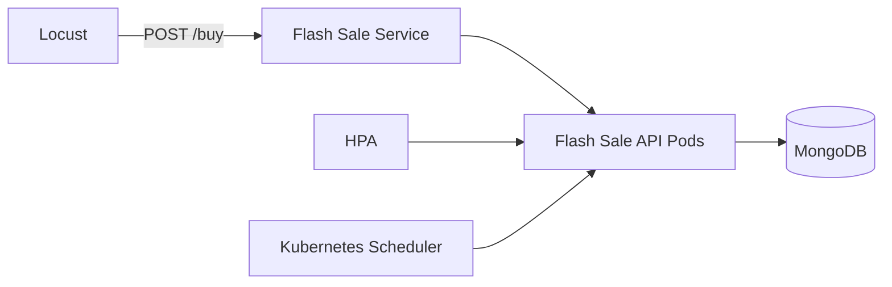

# Flash Sale Simulator

Dự án mô phỏng một hệ thống flash sale chạy trên Kubernetes/Minikube, gồm:

- `FastAPI` API nhận đơn hàng tại `/buy`
- `MongoDB` lưu đơn hàng giả lập
- `Locust` tạo burst 50k request để mô phỏng giờ cao điểm
- `Horizontal Pod Autoscaler (HPA)` tự scale app khi CPU tăng cao
- Multi-node Minikube để demo self-healing khi sập một worker node

## Mục tiêu demo cuối kỳ

Dự án này được chuẩn bị để quay video chứng minh 2 ý chính:

1. Hệ thống **tự scale up** khi nhận burst traffic lớn, mô phỏng flash sale.
2. Hệ thống **tự khắc phục** khi một worker node bị tắt, các pod còn sống vẫn tiếp tục phục vụ.

## Cấu trúc thư mục

- `main.py`: source code FastAPI.
- `Dockerfile`: build image cho API.
- `k8s-setup.yaml`: manifest Kubernetes cho Deployment, Service và HPA.
- `locustfile.py`: kịch bản load test bằng Locust.
- `requirements.txt`: thư viện Python cần cài.

## Yêu cầu môi trường

- Windows PowerShell
- Docker Desktop
- Minikube
- kubectl
- Python 3.11+ hoặc Python đang dùng trên máy
- Locust đã cài trong Python environment hiện tại

## Kiến trúc hệ thống



## Chức năng chính

- `POST /buy`: tạo đơn hàng giả lập, ghi vào MongoDB và tạo thêm tải CPU để HPA có tín hiệu rõ hơn.
- `GET /health`: endpoint kiểm tra sống còn cho Kubernetes.
- HPA của `flash-sale-app`: scale từ 3 đến 8 replicas theo CPU.

## Cài đặt và chạy nhanh

### 1. Cài dependencies Python

```powershell
python -m pip install -r requirements.txt
```

### 2. Tạo cluster Minikube 3 node

Nếu bạn đang muốn demo theo đúng bài, hãy tạo cluster 3 node:

```powershell
minikube delete -p minikube
minikube start -p minikube --driver=docker --nodes=3 --cpus=3 --memory=6144 --disk-size=30g
kubectl get nodes -o wide
```

Kết quả mong muốn:

- `minikube` = `Ready`
- `minikube-m02` = `Ready`
- `minikube-m03` = `Ready`

### 3. Bật metrics-server cho HPA

```powershell
minikube addons enable metrics-server -p minikube
```

Chờ vài chục giây cho `metrics-server` chuyển sang `Ready`.

### 4. Build image Docker

```powershell
docker build -t flash-sale-app:latest -f Dockerfile .
```

### 5. Nạp image vào Minikube

```powershell
minikube image load flash-sale-app:latest
```

Nếu gặp `ImagePullBackOff` ở một node worker, hãy xóa pod lỗi để Kubernetes tạo lại pod mới:

```powershell
kubectl delete pod <pod-name>
```

### 6. Deploy lên Kubernetes

```powershell
kubectl apply -f k8s-setup.yaml
kubectl get pods -o wide
kubectl get hpa
```

## Kịch bản quay video phần 5: HPA + Self-healing

### A. Chứng minh scale up khi bùng nổ request

1. Mở port-forward:

```powershell
kubectl port-forward svc/flash-sale-service 8000:8000
```

2. Mở terminal khác và bắn tải bằng Locust:

```powershell
locust -f locustfile.py --headless -u 500 -r 100 --run-time 2m --host=http://127.0.0.1:8000
```

3. Theo dõi HPA và pod:

```powershell
kubectl get hpa flash-sale-hpa -w
kubectl get pods -l app=flash-sale-app -w
```

Khi CPU tăng, HPA sẽ scale từ 3 replicas lên tối đa 8 replicas.

### B. Chứng minh tự khắc phục khi một node bị sập

Sau khi HPA đã scale up và pod đang chạy ổn, tắt một worker node:

```powershell
minikube node stop minikube-m02
```

Theo dõi tiếp:

```powershell
kubectl get nodes -w
kubectl get pods -l app=flash-sale-app -w
```

Kubernetes sẽ đánh dấu node là `NotReady` sau một thời gian ngắn và các pod trên node đó sẽ bị thay thế/reschedule sang node còn sống.

## Gợi ý kịch bản nói trong video

- “Đây là hệ thống flash sale mô phỏng trên Kubernetes.”
- “Khi lượng request tăng đột biến, HPA dựa vào CPU sẽ tự tăng số lượng pod.”
- “Sau đây tôi tắt một worker node để kiểm tra self-healing.”
- “Kubernetes phát hiện node lỗi, giữ dịch vụ tiếp tục chạy và tự bố trí lại workload trên các node còn sống.”

## Kiểm tra trạng thái hiện tại

```powershell
kubectl get nodes -o wide
kubectl get pods -o wide
kubectl get hpa
kubectl top pods
```

## Dọn môi trường

```powershell
kubectl delete -f k8s-setup.yaml
minikube delete -p minikube
```

## Lưu ý quan trọng

- HPA chỉ hoạt động tốt khi `metrics-server` đã `Ready`.
- `flash-sale-app` cần image `flash-sale-app:latest` có sẵn trong Minikube.
- Nếu muốn demo self-healing rõ hơn trong video ngắn, nên quay 2 pha riêng: một pha scale up và một pha tắt worker node.

## Tác giả / Mục đích

Dự án được xây dựng cho bài tập cuối kỳ về hệ thống cloud-native, tập trung vào:

- Auto-scaling
- Fault tolerance / self-healing
- Kubernetes multi-node deployment
