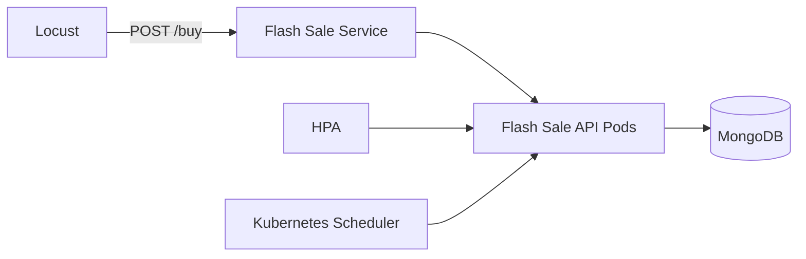

# Flash Sale Simulator

Dự án mô phỏng một hệ thống flash sale chạy trên Kubernetes/Minikube, gồm:

- `FastAPI` API nhận đơn hàng tại `/buy`
- `MongoDB` lưu đơn hàng giả lập
- `Locust` tạo burst 50k request để mô phỏng giờ cao điểm
- `Horizontal Pod Autoscaler (HPA)` tự scale app khi CPU tăng cao
- Multi-node Minikube để demo self-healing khi sập một worker node

## Mục đích của repository

Repository này được xây dựng để người chấm có thể kiểm tra toàn bộ demo theo đúng yêu cầu cuối kỳ, bao gồm:

- triển khai ứng dụng lên Kubernetes
- quan sát HPA tự scale khi có burst request lớn
- mô phỏng sự cố bằng cách tắt một worker node
- chứng minh hệ thống vẫn duy trì dịch vụ và tự điều phối lại pod

## Mục tiêu demo cuối kỳ

Dự án này được chuẩn bị để quay video chứng minh 2 ý chính:

1. Hệ thống **tự scale up** khi nhận burst traffic lớn, mô phỏng flash sale.
2. Hệ thống **tự khắc phục** khi một worker node bị tắt, các pod còn sống vẫn tiếp tục phục vụ.

## Cấu trúc thư mục

- `main.py`: source code FastAPI.
- `Dockerfile`: build image cho API.
- `k8s-setup.yaml`: manifest Kubernetes cho Deployment, Service và HPA.
- `locustfile.py`: kịch bản load test bằng Locust.
- `requirements.txt`: thư viện Python cần cài.

## Sao chép repository

```powershell
git clone https://github.com/ngvanhau1604/CSDLPT.git
cd CSDLPT
```

## Yêu cầu môi trường

- Windows PowerShell
- Docker Desktop
- Minikube
- kubectl
- Python 3.11+ hoặc Python đang dùng trên máy
- Locust đã cài trong Python environment hiện tại

## Ghi chú quan trọng trước khi chạy

- Cụm Minikube cần tối thiểu 3 node: 1 control plane và 2 worker.
- HPA chỉ hoạt động khi `metrics-server` đã ở trạng thái `Ready`.
- Image `flash-sale-app:latest` phải được build và nạp vào Minikube trước khi deploy.

## Kiến trúc hệ thống



## Chức năng chính

- `POST /buy`: tạo đơn hàng giả lập, ghi vào MongoDB và tạo thêm tải CPU để HPA có tín hiệu rõ hơn.
- `GET /health`: endpoint kiểm tra sống còn cho Kubernetes.
- HPA của `flash-sale-app`: scale từ 3 đến 8 replicas theo CPU.

## Hướng dẫn triển khai và kiểm tra

### 0. Chuẩn bị mã nguồn và môi trường

Nếu bạn vừa clone repository, hãy bảo đảm đang đứng tại thư mục dự án trước khi chạy các lệnh bên dưới.

### 1. Cài dependencies Python

```powershell
python -m pip install -r requirements.txt
```

### 2. Tạo cluster Minikube 3 node

Nếu bạn đang muốn demo theo đúng bài, hãy tạo cluster 3 node:

```powershell
minikube delete -p minikube
minikube start -p minikube --driver=docker --nodes=3 --cpus=3 --memory=6144 --disk-size=30g
kubectl get nodes -o wide
```

Kết quả mong muốn:

- `minikube` = `Ready`
- `minikube-m02` = `Ready`
- `minikube-m03` = `Ready`

### 3. Bật metrics-server cho HPA

```powershell
minikube addons enable metrics-server -p minikube
```

Chờ vài chục giây cho `metrics-server` chuyển sang `Ready`.

Kiểm tra lại:

```powershell
kubectl get pod -n kube-system
kubectl top nodes
```

### 4. Build image Docker

```powershell
docker build -t flash-sale-app:latest -f Dockerfile .
```

### 5. Nạp image vào Minikube

```powershell
minikube image load flash-sale-app:latest
```

Nếu gặp `ImagePullBackOff` ở một node worker, hãy xóa pod lỗi để Kubernetes tạo lại pod mới:

```powershell
kubectl delete pod <pod-name>
```

Sau đó kiểm tra image đã có trong cluster:

```powershell
minikube image ls | Select-String flash-sale-app
```

### 6. Deploy lên Kubernetes

```powershell
kubectl apply -f k8s-setup.yaml
kubectl get pods -o wide
kubectl get hpa
```

Kết quả mong đợi ban đầu:

- `flash-sale-app` có 3 pod chạy ổn định
- `flash-sale-hpa` xuất hiện trong `kubectl get hpa`
- `kubectl top pods` trả về số liệu CPU/memory

## Kịch bản quay video: HPA + Self-healing

### Mục tiêu video

1. Chứng minh ứng dụng đang chạy bình thường trên Kubernetes nhiều node.
2. Chứng minh HPA tự scale up khi có nhiều request.
3. Chứng minh hệ thống vẫn phục vụ được khi một worker node bị tắt.

### Bước 0: Khôi phục cluster nếu đang bị tắt

Nếu `kubectl` đang không kết nối được, chạy trước:

```powershell
minikube start -p minikube
minikube update-context -p minikube
kubectl get nodes -o wide
```

Chỉ bắt đầu quay khi cả 3 node đều `Ready`.

### Bước 1: Mở 4 terminal để quay cho rõ

Terminal 1:

```powershell
kubectl get hpa flash-sale-hpa -w
```

Terminal 2:

```powershell
kubectl get pods -l app=flash-sale-app -o wide -w
```

Terminal 3:

```powershell
kubectl get nodes -w
```

Terminal 4:

```powershell
kubectl port-forward svc/flash-sale-service 8000:8000
```

Mở tiếp trình duyệt và vào:

```text
http://127.0.0.1:8089
```

Đây là giao diện web của Locust, dùng để nhập số user, spawn rate và theo dõi kết quả trực quan.

### Bước 2: Quay cảnh hệ thống đang ổn định

Quay 5-10 giây cảnh:

```powershell
kubectl get nodes -o wide
kubectl get pods -l app=flash-sale-app -o wide
kubectl get hpa flash-sale-hpa
```

Câu nói mẫu:

“Ban đầu hệ thống đang chạy với 3 pod, HPA sẵn sàng scale khi tải tăng.”

### Bước 3: Bắn tải để HPA scale up

Mở terminal thứ 5 và chạy Locust ở chế độ giao diện:

```powershell
locust -f locustfile.py --host=http://127.0.0.1:8000
```

Sau đó mở trình duyệt tại `http://127.0.0.1:8089`, nhập:

- Host: `http://127.0.0.1:8000`
- Number of users: `500`
- Spawn rate: `100`
- Run time: để trống nếu muốn bấm Start thủ công, hoặc dùng nút Start trực tiếp trên UI

Nếu máy yếu hoặc CPU chưa tăng đủ, tăng lên `800` users và `150` spawn rate.

Trong lúc Locust chạy, quay đồng thời:

```powershell
kubectl get hpa flash-sale-hpa -w
kubectl get pods -l app=flash-sale-app -w
```

Chờ đến khi replicas tăng từ 3 lên cao hơn, tốt nhất là thấy rõ số pod tăng dần.

Câu nói mẫu:

“Khi lượng request tăng, CPU trung bình vượt ngưỡng 50%, HPA tự động tạo thêm pod.”

### Bước 4: Tắt 1 worker node để mô phỏng sự cố

Sau khi đã quay rõ phần scale up, chạy:

```powershell
minikube node stop minikube-m02
```

Tiếp tục quay `kubectl get nodes -w` và `kubectl get pods -l app=flash-sale-app -o wide -w`.

Điểm cần chờ để quay:

1. Node `minikube-m02` chuyển sang `NotReady`.
2. Pod nằm trên node đó bị `Terminating` hoặc được tạo lại trên node còn sống.
3. Dịch vụ vẫn phản hồi bình thường qua `port-forward`.

Nếu node chuyển trạng thái chậm, bạn có thể xóa thêm 1 pod đang nằm trên node lỗi để cảnh reschedule xuất hiện nhanh hơn:

```powershell
kubectl delete pod <pod-name>
```

Câu nói mẫu:

“Tôi tắt một worker node để mô phỏng lỗi hạ tầng, nhưng Kubernetes vẫn giữ dịch vụ chạy bằng cách điều phối lại pod sang node còn sống.”

### Bước 5: Chốt video

Quay thêm 10-15 giây ở trạng thái cuối để thấy:

```powershell
kubectl get nodes -o wide
kubectl get pods -l app=flash-sale-app -o wide
kubectl get hpa flash-sale-hpa
```

Chốt bằng một câu ngắn:

“Hệ thống đã chứng minh được auto-scaling và self-healing trên Kubernetes.”

### Checklist phải có trong video

1. Có cảnh ban đầu 3 node và 3 pod đang chạy.
2. Có cảnh Locust bắn tải vào API.
3. Có cảnh HPA tăng replicas.
4. Có cảnh tắt một worker node.
5. Có cảnh node chuyển `NotReady` và pod được thay thế.
6. Có cảnh ứng dụng vẫn phản hồi sau sự cố.

## Kiểm tra trạng thái hiện tại

```powershell
kubectl get nodes -o wide
kubectl get pods -o wide
kubectl get hpa
kubectl top pods
```

## Dọn môi trường

```powershell
kubectl delete -f k8s-setup.yaml
minikube delete -p minikube
```

## Lưu ý quan trọng

- HPA chỉ hoạt động tốt khi `metrics-server` đã `Ready`.
- `flash-sale-app` cần image `flash-sale-app:latest` có sẵn trong Minikube.
- Nếu muốn demo self-healing rõ hơn trong video ngắn, nên quay 2 pha riêng: một pha scale up và một pha tắt worker node.
- Không commit file `flash-sale-app.tar` hoặc thư mục `__pycache__` lên repository.


## Xử lý nhanh khi `kubectl` báo không kết nối được

Nếu `kubectl` báo lỗi kiểu `dial tcp 127.0.0.1:xxxxx: connectex: No connection could be made`, nguyên nhân thường là Minikube đang bị `Stopped` hoặc kubeconfig đang trỏ vào API server cũ.

Chạy lần lượt:

```powershell
minikube status -p minikube
minikube start -p minikube
minikube update-context -p minikube
kubectl get nodes -o wide
```

Nếu `minikube start` mất thời gian ở bước pull image, cứ để nó chạy xong rồi kiểm tra lại `kubectl get nodes`. Chỉ nên quay video khi cả 3 node đã lên và `kubectl` hoạt động bình thường.

## Tác giả / Mục đích

Dự án được xây dựng cho bài tập cuối kỳ về hệ thống cloud-native, tập trung vào:

- Auto-scaling
- Fault tolerance / self-healing
- Kubernetes multi-node deployment
